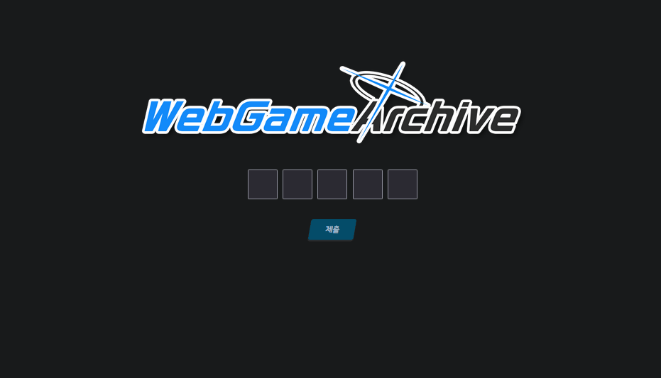

# Webgame Archive
****
WebGame archive is a simple website which you can play a simplified wordle game.


# Features - Wordle
****


Guess the given word within the fewest attempts.

``` javascript
        let answer = "weary"; // <--- your answer goes here
        function CheckAnswer(){
            count++;
            let input = document.querySelectorAll(".row .active");
            const template = `
            <div class="row">
            <input class="tile active">
            <input class="tile active">
            <input class="tile active">
            <input class="tile active">
            <input class="tile active">
        </div>
    `
```
will get input from blanks.
template will be used to create blanks if you failed to guess the word. 

``` js
            let correctCharCount = 0;
            for(let i =0; i<5; i++){
                if(input[i].value == answer[i]){
                    input[i].style.background = "green";
                    correctCharCount++;
                }
                else if(answer.includes(input[i].value)){
                    input[i].style.background = "yellow";
                }
                else{
                    input[i].style.background = "grey";
                }
                input[i].classList.remove("active");
            }

  

            if(correctCharCount === 5){
                document.getElementById("isWinner").innerHTML = "성공! 시도 횟수: " + count;
                document.getElementById("submitButton").style.display = "none";
            }
            else{
                document.querySelector(".gameBoard").insertAdjacentHTML("beforeend", template);
            }
        }
```

after checking the word, Blanks will be disabled.

## Features - Managing account

login
```PHP
$db = new mysqli($servername, $serverUserName, $dbPassword, $dbname) or die("Connection failed:");

  
  

$query = "SELECT password_hash FROM users WHERE login_id = '$user'";

$result = mysqli_query( $db, $query ) or die(mysqli_error($db));

//$db->close();

if(!$result || mysqli_num_rows($result) == 0) {

}

else if ( password_verify($userPassword, mysqli_fetch_assoc($result)["password_hash"])){

    $_SESSION['username'] = $user;

    $_SESSION['isLoggedIn'] = true;

  

    $query = "SELECT user_id FROM users WHERE login_id = '$user'";

    $_SESSION["UID"] = mysqli_query( $db, $query )->fetch_assoc()["user_id"];

    $UID = $_SESSION["UID"];

    $target = "profile_image_path";

    $query = "SELECT $target FROM profiles WHERE user_id = '$UID'";

    $_SESSION["imagePath"] = mysqli_query( $db, $query )->fetch_assoc()["$target"];

  

    //$target = "description";

    $query = "SELECT description FROM profiles WHERE user_id = '$UID'";

    $_SESSION["description"] = mysqli_query( $db, $query )->fetch_assoc()["description"];

    $query = "SELECT gaechu FROM profiles WHERE user_id = '$UID'";

    $_SESSION["gaechu"] = mysqli_query( $db, $query )->fetch_assoc()["gaechu"];

  

    $query = "SELECT score FROM scores WHERE user_id = '$UID'";

    $_SESSION["streak"] = mysqli_query( $db, $query )->fetch_assoc()["score"];

  
  
  
  
  
  

    header("Location: main.php");

    exit();

}

  

$_SESSION["failedLogin"] = true;

//header("Location: login.php");

```

if you successfully log in, info will be saved in session.

logout.php
``` php
<?php

session_start();
$_SESSION = array();
session_destroy();
$redirect_page = 'main.php';
header("Location: $redirect_page");
exit();
```
Redirecting to logout will destroy session info.

## Features - Search

Fetching and Displaying All Profiles.


```SQL
SELECT * FROM profiles
```

```php
        <nav>
            <?php
                while($row = $result->fetch_assoc()){ 
                    ?>
                <div class="navCard">
                    ">
                    <p>ID : [<?php echo $row["profile_id"];?>]</p>
                    <p>좋아요 : <?php echo $row["gaechu"];?></p>
                    <p>최대 연승 기록 : 0</p>
                    <p>코멘트</p>
                    <p class = "desc"><?php echo $row["description"];?></p>              
                </div>
                <?php
                }?>
        </nav>
```
This will create a navCard for each profile on the database.


``` js, PHP
    <script>

        function FilterProfiles() {

            let input = document.getElementById('searchString').value.toLowerCase();
            let profiles = document.querySelectorAll('.navCard');

            profiles.forEach(profile => {
                let description = profile.querySelector('.desc').innerText.toLowerCase();
                if (description.includes(input)) {
                    profile.classList.remove('hide');
                } else {
                    profile.classList.add('hide');
                }
            });
        }
    </script>
```

get input from textbox(id:searchString)


# TODO
************
Wordle

Get word and validate user input whether it is on the table or not.
[Word database](https://gist.github.com/dracos/dd0668f281e685bad51479e5acaadb93)

Increase a streak if you have cleared within 6 attempts. if not, Set streak to 0


Profiles
Make avater editable by getting users from image and save it to server db.
Be able to search, sort profiles by streaks, names and so on.
Make search funtion better by using regex. For example, if your search command is score>5,
```
score>\d+
```
catch this pattern by using js and display matching profiles.


